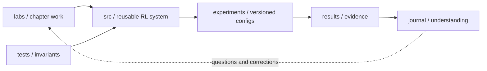

# Krybor RL

> Reinforcement learning, rebuilt from first principles.

Krybor RL is a long-term learning laboratory for understanding reinforcement
learning deeply enough to derive it, implement it, test it, and explain why it
works. The repository begins with small tabular problems and is designed to grow
into function approximation and deep RL without being tied to robotics, games,
or any other application domain.

This is not a collection of finished-library wrappers. The source code is the
curated result; the labs, experiments, and journal preserve the reasoning that
produced it.

## Current checkpoint

| Area | Repository baseline | Learning status |
| --- | --- | --- |
| RL foundations | Agent-environment framing and learning prompts | Rebuilding in code |
| Multi-armed bandits | Sample-average epsilon-greedy testbed | Rebuilding in code |
| Finite MDPs | Explicit stochastic GridWorld model | Rebuilding in code |
| Dynamic programming | Policy evaluation, policy iteration, value iteration | Rebuilding in code |
| Monte Carlo | Deliberately not implemented yet | Next milestone |

“Baseline exists” does not mean “mastered.” A topic is only complete after its
lab, tests, reproducible experiment, and written reflection satisfy the
[definition of done](docs/DEFINITION_OF_DONE.md).

## The system



The key design rule is simple: **learning is organized by chapter; software is
organized by responsibility**. Chapter 5 will add a lab under `labs/`, but Monte
Carlo code will live under `src/krybor_rl/algorithms/`, trajectories under
`core/`, and shared environments under `environments/`.

## Run it

Python 3.11 or newer is required. There are no runtime dependencies.

```bash
python3.11 -m venv .venv
source .venv/bin/activate
python -m pip install -e .
make check
```

Run the current baselines:

```bash
krybor-rl bandit --steps 1000 --runs 200
krybor-rl plan --algorithm value-iteration
krybor-rl compare
```

Every important experiment can also be stored as config instead of hidden in
shell history:

```bash
krybor-rl run experiments/configs/ch02_bandit.toml
krybor-rl run experiments/configs/ch04_value_iteration.toml
```

Without installing the package:

```bash
PYTHONPATH=src python -m krybor_rl plan --algorithm policy-iteration
```

## Repository map

```text
.
├── src/krybor_rl/
│   ├── core/             # MDP and trajectory primitives
│   ├── environments/     # dynamics; never owns learning logic
│   ├── agents/           # reusable action-selection components
│   ├── algorithms/       # prediction, control, and planning
│   ├── evaluation/       # experiment runners and rollouts
│   ├── visualization/    # presentation only
│   └── interfaces/       # CLI and config loading
├── labs/                 # chapter-shaped learning work
├── experiments/configs/  # reproducible experiment definitions
├── results/              # small, interpretable evidence
├── journal/              # predictions, observations, reflections
├── docs/                 # vision, architecture, curriculum, standards
└── tests/                # mathematical and software invariants
```

See [ARCHITECTURE.md](docs/ARCHITECTURE.md) for dependency rules and extension
examples.

## Current learning environment

The tabular control task is a stochastic rescue GridWorld:

```text
S......G
.XXXXXX.
....#...
........
```

The agent chooses north, east, south, or west. Actuator noise can slip it into a
perpendicular direction. The short upper route is optimal when movement is
reliable; the longer lower route becomes preferable as uncertainty increases.
Because the full transition model is enumerable, Chapters 3–4 can use expected
Bellman backups. Chapter 5 will intentionally remove that privilege and learn
from sampled episodes.

## How to study here every day

1. Choose one question from the current lab.
2. Write a prediction in the journal before running anything.
3. Implement the smallest behavior that answers the question.
4. Add or update a test for the relevant invariant.
5. Run a seeded experiment and preserve the config.
6. Record what changed in your mental model.
7. Promote generally useful code from the lab into `src/`.

Start at [LEARNING.md](LEARNING.md), then work through the current folder in
[labs/](labs/README.md).

## Roadmap

- **Tabular core:** foundations, bandits, MDPs, dynamic programming, Monte Carlo,
  temporal-difference learning, n-step methods, planning.
- **Approximation:** value-function approximation, policy gradients, actor-critic,
  off-policy stability.
- **Deep RL:** neural value methods, deep policy optimization, replay, target
  networks, representation and evaluation discipline.
- **Specialization:** chosen only after the pure-RL core is strong. Robotics is
  one possible consumer, not an architectural dependency of this repository.

The detailed sequence and evidence expected at each stage live in
[CURRICULUM.md](docs/CURRICULUM.md).

## Reference

The primary learning reference is Richard S. Sutton and Andrew G. Barto,
*Reinforcement Learning: An Introduction*, second edition. Implementations here
are original learning exercises, not a replacement for the book.
